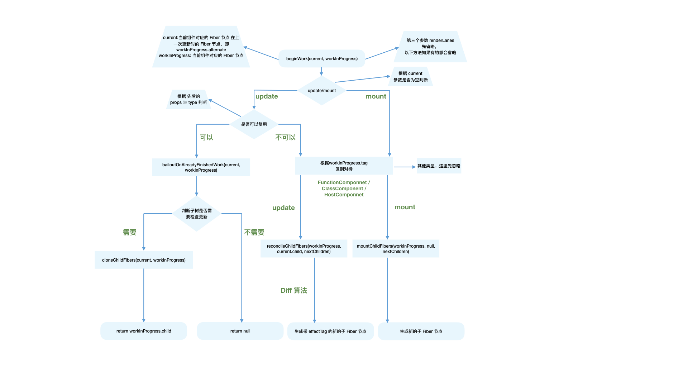

# cra-react-debugger

基于 cra 脚手架创建 react 项目并调试react@18.2.0源码

## 一、准备

```sh
# 1、初始化项目
npx create-react-app cra-debugger

# 2、使用cra提供的自定义配置
npm run eject

# 3、拉取v18.2.0 tag 的react
cd src && git clone https://github.com/facebook/react.git
# 更新分支并切换并创建18.2.0分支
git remote update && git checkout -b v18.2.0 v18.2.0
# 删除react文件夹下的.git文件夹

# 注意：需要切换node版本至v16，否则会报错：Current node version is not supported for development, expected "18.14.0" to satisfy "^12.17.0 || 13.x || 14.x || 15.x || 16.x || 17.x".
nvm use v16


# 4、打包react、scheduler、react-dom成cjs包
yarn build react/index,react/jsx,react-dom/index,scheduler --type=NODE

# 5、在源码目录 build/node_modules 为 react、react-dom 创建 yarn link
# 通过yarn link 可以改变项目中依赖包的目录指向
# 声明react指向
cd build/node_modules/react && yarn link
# 声明react-dom指向
cd build/node_modules/react-dom && yarn link

# 6、进入项目根目录，通过yarn link 将项目中的react、react-dom的指向刚刚打包好的react、react-dom
yarn link react react-dom

# 7、修改src/react/build/node_modules/react/cjs/react.development.js添加console.log，启动项目发现执行了打印

```

### 1、react 的目录结构

```
// src/react/packages
.
├── dom-event-testing-library
├── eslint-plugin-react-hooks
├── jest-mock-scheduler
├── jest-react
├── react
├── react-art // react-art 渲染器，用于渲染到canvas、svg
├── react-cache // 创建自定义的流
├── react-client // 创建自定义的流
├── react-debug-tools
├── react-devtools
├── react-devtools-core
├── react-devtools-extensions
├── react-devtools-inline
├── react-devtools-shared
├── react-devtools-shell
├── react-devtools-timeline
├── react-dom // react-dom 渲染器
├── react-fetch // 用于数据请求
├── react-fs
├── react-interactions // 用于测试交互相关的内部特性，比如React的事件模型
├── react-is // 用于测试组件是否是某类型
├── react-native-renderer // react-native 渲染器
├── react-noop-renderer // noop 渲染器，方便 debug fiber
├── react-pg
├── react-reconciler // 协调器
├── react-refresh // “热重载”的React官方实现
├── react-server // 创建自定义SSR流
├── react-server-dom-relay
├── react-server-dom-webpack
├── react-server-native-relay
├── react-suspense-test-utils
├── react-test-renderer
├── scheduler // 调度器
├── shared // 公共方法
├── use-subscription
└── use-sync-external-store
```

### 2、`render` 阶段

> `render阶段`开始于`performSyncWorkOnRoot`或`performConcurrentWorkOnRoot`方法的调用。这取决于本次更新是同步更新还是异步更新。我们现在还不需要学习这两个方法，只需要知道在这两个方法中会调用如下两个方法：

```js
// performSyncWorkOnRoot会调用该方法
function workLoopSync() {
  while (workInProgress !== null) {
    performUnitOfWork(workInProgress);
  }
}

// performConcurrentWorkOnRoot会调用该方法
function workLoopConcurrent() {
  while (workInProgress !== null && !shouldYield()) {
    performUnitOfWork(workInProgress);
  }
}
```

> 可以看到，他们唯一的区别是是否调用`shouldYield`。如果当前浏览器帧没有剩余时间，`shouldYield`会中止循环，直到浏览器有空闲时间后再继续遍历。

> `workInProgress`代表当前已创建的`workInProgress fiber`。

> `performUnitOfWork`方法会创建下一个`Fiber节点`并赋值给`workInProgress`，并将`workInProgress`与已创建的`Fiber节点`连接起来构成`Fiber树`。

> 我们知道`Fiber Reconciler`是从`Stack Reconciler`重构而来，通过遍历的方式实现可中断的递归，所以`performUnitOfWork`的工作可以分为两部分：“递”和“归”。

#### 2.1 “递”阶段

> 首先从`rootFiber`开始向下深度优先遍历。为遍历到的每个`Fiber节点`调用[beginWork 方法 ](https://github.com/facebook/react/blob/970fa122d8188bafa600e9b5214833487fbf1092/packages/react-reconciler/src/ReactFiberBeginWork.new.js#L3058)。

> 该方法会根据传入的`Fiber节点`创建`子Fiber节点`，并将这两个`Fiber节点`连接起来。

> 当遍历到叶子节点（即没有子组件的组件）时就会进入“归”阶段。

#### 2.2 “归”阶段

> 在“归”阶段会调用[completeWork](https://github.com/facebook/react/blob/970fa122d8188bafa600e9b5214833487fbf1092/packages/react-reconciler/src/ReactFiberCompleteWork.new.js#L652)处理`Fiber节点`。

> 当某个`Fiber节点`执行完`completeWork`，如果其存在`兄弟Fiber节点`（即`fiber.sibling !== null`），会进入其`兄弟Fiber`的“递”阶段。

> 如果不存在`兄弟Fiber`，会进入`父级Fiber`的“归”阶段。

> “递”和“归”阶段会交错执行直到“归”到`rootFiber`。至此，`render阶段`的工作就结束了。

##### 2.2.1 例：简单介绍下下面代码的 render 阶段执行过程

```js
function App() {
  return (
    <div>
      i am
      <span>KaSong</span>
    </div>
  );
}

ReactDOM.render(<App />, document.getElementById("root"));
```

解：

对应 `fiber树` 结构：

 

`render阶段` 会依次执行：

```md
rootFiber beginWork
App Fiber beginWork
div Fiber beginWork
"i am" Fiber beginWork
"i am" Fiber completeWork
span Fiber beginWork
span Fiber completeWork
div Fiber completeWork
App Fiber completeWork
rootFiber completeWork
```

> 注意：之所以没有 “KaSong” Fiber 的 beginWork/completeWork，是因为作为一种性能优化手段，针对只有单一文本子节点的`Fiber`，`React`会特殊处理。

> 以上介绍了`render阶段`会调用的方法。在接下来会讲解`beginWork`和`completeWork`做的具体工作。

##### 2.2.2 beginWork

上一节我们了解到`render阶段`的工作可以分为“递”阶段和“归”阶段。其中“递”阶段会执行 `beginWork`，“归”阶段会执行`completeWork`。这一节我们看看“递”阶段的`beginWork`方法究竟做了什么。

###### 2.2.2.1 方法概览

> `beginWork` 的工作是传入 `当前Fiber节点`，创建 `子Fiber节点`，我们从传参来看看具体是如何做的。

```js
function beginWork(
  current: Fiber | null, // 当前组件对应的Fiber节点在上一次更新时的Fiber节点，即workInProgress.alternate
  workInProgress: Fiber, // 当前组件对应的Fiber节点
  renderLanes: Lanes // 优先级相关，在讲解Scheduler时再讲解
): Fiber | null {
  // ...省略函数体
}
```

> 从[双缓存机制一节](https://react.iamkasong.com/process/doubleBuffer.html)我们知道，除[`rootFiber`](https://react.iamkasong.com/process/doubleBuffer.html#mount时)以外， 组件 `mount` 时，由于是首次渲染，是不存在当前组件对应的 `Fiber节点` 在上一次更新时的 `Fiber节点`，即 `mount` 时 `current === null`。组件 `update` 时，由于之前已经 `mount` 过，所以 `current !== null`。

> 所以我们可以通过 `current === null ?` 来区分组件是处于 `mount` 还是 `update`。

> 基于此原因，`beginWork` 的工作可以分为两部分：

- `update` 时：如果 `current` 存在，在满足一定条件时可以复用 `current` 节点，这样就能克隆 `current.child` 作为 `workInProgress.child`，而不需要新建 `workInProgress.child`。
- `mount` 时：除 `fiberRootNode` 以外，`current === null`。会根据 `fiber.tag` 不同，创建不同类型的 `子Fiber节点`。

```js
function beginWork(
  current: Fiber | null,
  workInProgress: Fiber,
  renderLanes: Lanes
): Fiber | null {
  // update时：如果current存在可能存在优化路径，可以复用current（即上一次更新的Fiber节点）
  if (current !== null) {
    // ...省略

    // 复用current
    return bailoutOnAlreadyFinishedWork(current, workInProgress, renderLanes);
  } else {
    didReceiveUpdate = false;
  }

  // mount时：根据tag不同，创建不同的子Fiber节点
  switch (workInProgress.tag) {
    case IndeterminateComponent:
    // ...省略
    case LazyComponent:
    // ...省略
    case FunctionComponent:
    // ...省略
    case ClassComponent:
    // ...省略
    case HostRoot:
    // ...省略
    case HostComponent:
    // ...省略
    case HostText:
    // ...省略
    // ...省略其他类型
  }
}
```

###### 2.2.2.2 Update 时

> 我们可以看到，满足如下情况时 `didReceiveUpdate === false`（即可以直接复用前一次更新的 `子Fiber`，不需要新建 `子Fiber`）。

> 1. `oldProps === newProps && workInProgress.type === current.type`，即`props`与`fiber.type`不变
> 2. `!includesSomeLane(renderLanes, updateLanes)`，即当前`Fiber节点`优先级不够，会在讲解`Scheduler`时介绍

###### 2.2.2.3 Mount 时

当不满足优化路径时，我们就进入第二部分，新建 `子Fiber`。

我们可以看到，根据 `fiber.tag`不同，进入不同类型`Fiber`的创建逻辑。

```js
// mount时：根据tag不同，创建不同的Fiber节点
switch (workInProgress.tag) {
  case IndeterminateComponent:
  // ...省略
  case LazyComponent:
  // ...省略
  case FunctionComponent:
  // ...省略
  case ClassComponent:
  // ...省略
  case HostRoot:
  // ...省略
  case HostComponent:
  // ...省略
  case HostText:
  // ...省略
  // ...省略其他类型
}
```

对于我们常见的组件类型，如（`FunctionComponent`/`ClassComponent`/`HostComponent`），最终会进入[reconcileChildren](https://github.com/facebook/react/blob/1fb18e22ae66fdb1dc127347e169e73948778e5a/packages/react-reconciler/src/ReactFiberBeginWork.new.js#L233)方法。

###### 2.2.2.4 reconcileChildren

从该函数名就能看出这是 `Reconciler` 模块的核心部分。那么他究竟做了什么呢？

- 对于 `mount` 的组件，他会创建新的 `子Fiber节点`；

- 对于 `update` 的组件，他会将当前组件与该组件在上次更新时对应的 `Fiber节点` 比较（也就是俗称的`Diff`算法），将比较的结果生成新 `Fiber节点`。

  ```js
  export function reconcileChildren(
    current: Fiber | null,
    workInProgress: Fiber,
    nextChildren: any,
    renderLanes: Lanes
  ) {
    if (current === null) {
      // 对于mount的组件
      workInProgress.child = mountChildFibers(
        workInProgress,
        null,
        nextChildren,
        renderLanes
      );
    } else {
      // 对于update的组件
      workInProgress.child = reconcileChildFibers(
        workInProgress,
        current.child,
        nextChildren,
        renderLanes
      );
    }
  }
  ```

  不论走哪个逻辑，最终他会生成新的 `子Fiber节点` 并赋值给 `workInProgress.child`，作为本次 `beginWork`[返回值 ](https://github.com/facebook/react/blob/1fb18e22ae66fdb1dc127347e169e73948778e5a/packages/react-reconciler/src/ReactFiberBeginWork.new.js#L1158)，并作为下次 `performUnitOfWork` 执行时 `workInProgress` 的[传参 (opens new window)](https://github.com/facebook/react/blob/1fb18e22ae66fdb1dc127347e169e73948778e5a/packages/react-reconciler/src/ReactFiberWorkLoop.new.js#L1702)。

  注意 ⚠️：值得一提的是，`mountChildFibers` 与 `reconcileChildFibers` 这两个方法的逻辑基本一致。唯一的区别是：`reconcileChildFibers` 会为生成的 `Fiber节点` 带上 `effectTag` 属性，而 `mountChildFibers` 不会。

###### 2.2.2.5 effectTag

我们知道，`render阶段` 的工作是在内存中进行，当工作结束后会通知 `Renderer` 需要执行的 `DOM` 操作。要执行 `DOM` 操作的具体类型就保存在 `fiber.effectTag` 中。

> 你可以从[这里](https://github.com/facebook/react/blob/1fb18e22ae66fdb1dc127347e169e73948778e5a/packages/react-reconciler/src/ReactSideEffectTags.js)看到 `effectTag` 对应的 `DOM` 操作。

```js
// DOM需要插入到页面中
export const Placement = /*                */ 0b00000000000010;
// DOM需要更新
export const Update = /*                   */ 0b00000000000100;
// DOM需要插入到页面中并更新
export const PlacementAndUpdate = /*       */ 0b00000000000110;
// DOM需要删除
export const Deletion = /*                 */ 0b00000000001000;
```

> 通过二进制表示 `effectTag`，可以方便的使用位操作为 `fiber.effectTag` 赋值多个 `effect`。

那么，如果要通知 `Renderer` 将 `Fiber节点` 对应的 `DOM节点` 插入页面中，需要满足两个条件：

1. `fiber.stateNode` 存在，即 `Fiber节点` 中保存了对应的 `DOM节点`；
2. `(fiber.effectTag & Placement) !== 0`，即 `Fiber节点` 存在 `Placement effectTag`。

我们知道，`mount` 时，`fiber.stateNode === null`，且在 `reconcileChildren` 中调用的 `mountChildFibers` 不会为 `Fiber节点` 赋值 `effectTag`。那么首屏渲染如何完成呢？

针对第一个问题，`fiber.stateNode `会在 `completeWork` 中创建，我们会在下一节介绍。

第二个问题的答案十分巧妙：假设 `mountChildFibers` 也会赋值 `effectTag`，那么可以预见 `mount` 时整棵 `Fiber树` 所有节点都会有 `Placement effectTag`。那么 `commit阶段` 在执行 `DOM` 操作时每个节点都会执行一次插入操作，这样大量的 `DOM`操作是极低效的。

为了解决这个问题，在 `mount` 时只有 `rootFiber` 会赋值 `Placement effectTag`，在 `commit阶段` 只会执行一次插入操作。

beginWork 流程图：



##### 2.2.3 complateWork

在流程概览一节，我们了解组件在 `render阶段` 会经历 `beginWork` 与 `completeWork`。

上一节我们讲解了组件执行 `beginWork `后会创建 `子Fiber节点`，节点上可能存在 `effectTag`。

这一节让我们看看 `completeWork` 会做什么工作。

###### 2.2.3.1 方法概览

类似 `beginWork`，`completeWork` 也是针对不同 `fiber.tag` 调用不同的处理逻辑。

```js
function completeWork(
  current: Fiber | null,
  workInProgress: Fiber,
  renderLanes: Lanes,
): Fiber | null {
  const newProps = workInProgress.pendingProps;

  switch (workInProgress.tag) {
    case IndeterminateComponent:
    case LazyComponent:
    case SimpleMemoComponent:
    case FunctionComponent:
    case ForwardRef:
    case Fragment:
    case Mode:
    case Profiler:
    case ContextConsumer:
    case MemoComponent:
      return null;
    case ClassComponent: {
      // ...省略
      return null;
    }
    case HostRoot: {
      // ...省略
      updateHostContainer(workInProgress);
      return null;
    }
    case HostComponent: {
      // ...省略
      return null;
    }
  // ...省略
```

我们重点关注页面渲染所必须的 `HostComponent`（即原生 `DOM组件` 对应的 `Fiber节点`），其他类型 `Fiber` 的处理留在具体功能实现时讲解。

###### 2.2.3.2 处理 `HostCompnent`

和 `beginWork` 一样，我们根据 `current === null ?` 判断是 `mount` 还是 `update`。

同时针对 `HostComponent`，判断 `update` 时我们还需要考虑 `workInProgress.stateNode != null ?`（即该 `Fiber节点`是否存在对应的 `DOM节点`）。

```js
case HostComponent: {
  popHostContext(workInProgress);
  const rootContainerInstance = getRootHostContainer();
  const type = workInProgress.type;

  if (current !== null && workInProgress.stateNode != null) {
    // update的情况
    // ...省略
  } else {
    // mount的情况
    // ...省略
  }
  return null;
}
```

###### 2.2.3.3 `update` 时

当 `update` 时，`Fiber节点` 已经存在对应 `DOM节点`，所以不需要生成 `DOM节点`。需要做的主要是处理 `props`，比如：

- `onClick`、`onChange`等回调函数的注册
- 处理 `style prop`
- 处理 `DANGEROUSLY_SET_INNER_HTML prop`
- 处理 `children prop`

我们去掉一些当前不需要关注的功能（比如 `ref`）。可以看到最主要的逻辑是调用 `updateHostComponent` 方法。

```js
if (current !== null && workInProgress.stateNode != null) {
  // update的情况
  updateHostComponent(
    current,
    workInProgress,
    type,
    newProps,
    rootContainerInstance
  );
}
```

你可以从[这里 (opens new window)](https://github.com/facebook/react/blob/1fb18e22ae66fdb1dc127347e169e73948778e5a/packages/react-reconciler/src/ReactFiberCompleteWork.new.js#L225)看到 `updateHostComponent` 方法定义。

在 `updateHostComponent` 内部，被处理完的 `props` 会被赋值给 `workInProgress.updateQueue`，并最终会在 `commit阶段` 被渲染在页面上。

```js
workInProgress.updateQueue = (updatePayload: any);
```

其中 `updatePayload` 为数组形式，他的偶数索引的值为变化的 `prop key`，奇数索引的值为变化的 `prop value`。

> 具体渲染过程见 [mutation 阶段一节](https://react.iamkasong.com/renderer/mutation.html#hostcomponent-mutation)

###### 2.2.3.4 `mount` 时

同样，我们省略了不相关的逻辑。可以看到，`mount` 时的主要逻辑包括三个：

- 为 `Fiber节点` 生成对应的 `DOM节点`；
- 将子孙 `DOM节点` 插入刚生成的 `DOM节点` 中；
- 与 `update` 逻辑中的 `updateHostComponent` 类似的处理 `props` 的过程；

```js
// mount的情况

// ...省略服务端渲染相关逻辑

const currentHostContext = getHostContext();
// 为fiber创建对应DOM节点
const instance = createInstance(
  type,
  newProps,
  rootContainerInstance,
  currentHostContext,
  workInProgress
);
// 将子孙DOM节点插入刚生成的DOM节点中
appendAllChildren(instance, workInProgress, false, false);
// DOM节点赋值给fiber.stateNode
workInProgress.stateNode = instance;

// 与update逻辑中的updateHostComponent类似的处理props的过程
if (
  finalizeInitialChildren(
    instance,
    type,
    newProps,
    rootContainerInstance,
    currentHostContext
  )
) {
  markUpdate(workInProgress);
}
```

还记得[上一节](https://react.iamkasong.com/process/beginWork.html#effecttag)我们讲到：`mount` 时只会在 `rootFiber` 存在`Placement effectTag`。那么`commit阶段`是如何通过一次插入`DOM`操作（对应一个`Placement effectTag`）将整棵 `DOM树` 插入页面的呢？

原因就在于 `completeWork` 中的 `appendAllChildren` 方法。

由于 `completeWork` 属于“归”阶段调用的函数，每次调用 `appendAllChildren` 时都会将已生成的子孙 `DOM节点` 插入当前生成的 `DOM节点` 下。那么当“归”到 `rootFiber` 时，我们已经有一个构建好的离屏 `DOM树`。

###### 2.2.3.5 `effectList`

至此 `render阶段` 的绝大部分工作就完成了。

还有一个问题：作为 `DOM` 操作的依据，`commit阶段` 需要找到所有有 `effectTag` 的 `Fiber节点` 并依次执行 `effectTag` 对应操作。难道需要在 `commit阶段` 再遍历一次 `Fiber树` 寻找 `effectTag !== null` 的 `Fiber节点` 么？

这显然是很低效的。

为了解决这个问题，在 `completeWork` 的上层函数 `completeUnitOfWork` 中，每个执行完 `completeWork` 且存在 `effectTag` 的 `Fiber节点` 会被保存在一条被称为 `effectList` 的单向链表中。

`effectList ` 中第一个 `Fiber节点` 保存在 `fiber.firstEffect`，最后一个元素保存在 `fiber.lastEffect`。

类似 `appendAllChildren`，在“归”阶段，所有有 `effectTag` 的 `Fiber节点` 都会被追加在 `effectList` 中，最终形成一条以 `rootFiber.firstEffect` 为起点的单向链表。

```js
                       nextEffect         nextEffect
rootFiber.firstEffect -----------> fiber -----------> fiber
```

这样，在 `commit阶段` 只需要遍历 `effectList` 就能执行所有 `effect` 了。

你可以在[这里 (opens new window)](https://github.com/facebook/react/blob/1fb18e22ae66fdb1dc127347e169e73948778e5a/packages/react-reconciler/src/ReactFiberWorkLoop.new.js#L1744)看到这段代码逻辑。

借用 `React` 团队成员**Dan Abramov**的话：`effectList ` 相较于 `Fiber树`，就像圣诞树上挂的那一串彩灯。

###### 2.2.3.6 流程结尾

至此，`render阶段` 全部工作完成。在 `performSyncWorkOnRoot` 函数中 `fiberRootNode` 被传递给 `commitRoot` 方法，开启 `commit阶段` 工作流程。


### 3、`commit` 阶段

从上一节我们知道，在 `render` 阶段发生更新的组件对应的 `Fiber` 节点会被打上 `effectTag`。这些 `Fiber` 节点在 `render` 阶段的“归”阶段会形成一条链表。在 `commit` 阶段会遍历这条链表并执行对应的操作，这些操作被称为 `mutation`。

对于 `HostComponent` 而言，意味着 `Dom` 节点的增、删、改。

上一章[最后一节](https://react.iamkasong.com/process/completeWork.html#流程结尾)我们介绍了，`commitRoot` 方法是 `commit阶段` 工作的起点。`fiberRootNode `会作为传参。

```js
commitRoot(fiberRootNode);
```

在 `rootFiber.firstEffect` 上保存了一条需要执行 `副作用` 的 `Fiber节点` 的单向链表 `effectList`，这些 `Fiber节点` 的 `updateQueue` 中保存了变化的 `props`。

这些 `副作用` 对应的 `DOM操作` 在 `commit` 阶段执行。

除此之外，一些生命周期钩子（比如 `componentDidXXX` ）、`hook`（比如 `useEffect`）需要在 `commit` 阶段执行。

`commit` 阶段的主要工作（即 `Renderer` 的工作流程）分为三部分：

- `before mutation 阶段`（执行 `DOM` 操作前）
- `mutation 阶段`（执行 `DOM` 操作）
- `layout 阶段`（执行 `DOM` 操作后）

你可以从[这里 (opens new window)](https://github.com/facebook/react/blob/1fb18e22ae66fdb1dc127347e169e73948778e5a/packages/react-reconciler/src/ReactFiberWorkLoop.new.js#L2001)看到`commit`阶段的完整代码

在 `before mutation阶段` 之前和 `layout阶段` 之后还有一些额外工作，涉及到比如 `useEffect` 的触发、`优先级相关` 的重置、`ref `的绑定/解绑。

这些对我们当前属于超纲内容，为了内容完整性，在这节简单介绍。

#### 3.1 流程概览

##### 3.1.1 `before mutation` 之前

`commitRootImpl `方法中直到第一句 `if (firstEffect !== null)` 之前属于 `before mutation` 之前。

我们大体看下他做的工作，现在你还不需要理解他们。

```js
do {
  // 触发useEffect回调与其他同步任务。由于这些任务可能触发新的渲染，所以这里要一直遍历执行直到没有任务
  flushPassiveEffects();
  // 在执行本次commit 操作前需要判断是否有未执行的effect。如存在，则执行那些effect。
} while (rootWithPendingPassiveEffects !== null);

// root指 fiberRootNode
// root.finishedWork指当前应用的rootFiber
const finishedWork = root.finishedWork;

// 凡是变量名带lane的都是优先级相关
const lanes = root.finishedLanes;
if (finishedWork === null) {
  return null;
}
root.finishedWork = null;
root.finishedLanes = NoLanes;

// 重置Scheduler绑定的回调函数
root.callbackNode = null;
root.callbackId = NoLanes;

let remainingLanes = mergeLanes(finishedWork.lanes, finishedWork.childLanes);
// 重置优先级相关变量
markRootFinished(root, remainingLanes);

// 清除已完成的discrete updates，例如：用户鼠标点击触发的更新。
if (rootsWithPendingDiscreteUpdates !== null) {
  if (
    !hasDiscreteLanes(remainingLanes) &&
    rootsWithPendingDiscreteUpdates.has(root)
  ) {
    rootsWithPendingDiscreteUpdates.delete(root);
  }
}

// 重置全局变量
if (root === workInProgressRoot) {
  workInProgressRoot = null;
  workInProgress = null;
  workInProgressRootRenderLanes = NoLanes;
} else {
}

// 将effectList赋值给firstEffect
// 由于每个fiber的effectList只包含他的子孙节点
// 所以根节点如果有effectTag则不会被包含进来
// 所以这里将有effectTag的根节点插入到effectList尾部
// 这样才能保证有effect的fiber都在effectList中
let firstEffect;
if (finishedWork.effectTag > PerformedWork) {
  if (finishedWork.lastEffect !== null) {
    finishedWork.lastEffect.nextEffect = finishedWork;
    firstEffect = finishedWork.firstEffect;
  } else {
    firstEffect = finishedWork;
  }
} else {
  // 根节点没有effectTag
  firstEffect = finishedWork.firstEffect;
}
```

可以看到，`before mutation` 之前主要做一些变量赋值，状态重置的工作。

这一长串代码我们只需要关注最后赋值的 `firstEffect`，在 `commit` 的三个子阶段都会用到他。

##### 3.1.2 `layout` 之后

接下来让我们简单看下 `layout` 阶段执行完后的代码，现在你还不需要理解他们：

```js
const rootDidHavePassiveEffects = rootDoesHavePassiveEffects;

// useEffect相关
if (rootDoesHavePassiveEffects) {
  rootDoesHavePassiveEffects = false;
  rootWithPendingPassiveEffects = root;
  pendingPassiveEffectsLanes = lanes;
  pendingPassiveEffectsRenderPriority = renderPriorityLevel;
} else {
}

// 性能优化相关
if (remainingLanes !== NoLanes) {
  if (enableSchedulerTracing) {
    // ...
  }
} else {
  // ...
}

// 性能优化相关
if (enableSchedulerTracing) {
  if (!rootDidHavePassiveEffects) {
    // ...
  }
}

// ...检测无限循环的同步任务
if (remainingLanes === SyncLane) {
  // ...
}

// 在离开commitRoot函数前调用，触发一次新的调度，确保任何附加的任务被调度
ensureRootIsScheduled(root, now());

// ...处理未捕获错误及老版本遗留的边界问题

// 执行同步任务，这样同步任务不需要等到下次事件循环再执行
// 比如在 componentDidMount 中执行 setState 创建的更新会在这里被同步执行
// 或useLayoutEffect
flushSyncCallbackQueue();

return null;
```

你可以在[这里 (opens new window)](https://github.com/facebook/react/blob/1fb18e22ae66fdb1dc127347e169e73948778e5a/packages/react-reconciler/src/ReactFiberWorkLoop.new.js#L2195)看到这段代码。

主要包括三点内容：

1. `useEffect` 相关的处理。我们会在讲解 `layout阶段` 时讲解。

2. 性能追踪相关。

   源码里有很多和 `interaction` 相关的变量。他们都和追踪 `React` 渲染时间、性能相关，在[Profiler API (opens new window)](https://zh-hans.reactjs.org/docs/profiler.html)和[DevTools (opens new window)](https://github.com/facebook/react-devtools/pull/1069)中使用。

   你可以在这里看到[interaction 的定义](https://gist.github.com/bvaughn/8de925562903afd2e7a12554adcdda16#overview)

3. 在`commit`阶段会触发一些生命周期钩子（如 `componentDidXXX`）和`hook`（如`useLayoutEffect`、`useEffect`）。

   在这些回调方法中可能触发新的更新，新的更新会开启新的 `render-commit` 流程。

#### 3.2 `before mutation` 阶段

`Renderer` 工作的阶段被称为 `commit` 阶段。`commit` 阶段可以分为三个子阶段：

- `before mutataion` 阶段（执行 `Dom` 操作前）
- `mutation` 阶段（执行 `Dom` 操作）
- `layout` 阶段（执行 `Dom` 操作后 ）

下面介绍 `before mutation` 阶段（执行 `	Dom` 操作前）都做了什么

##### 3.2.1 概览

`bofore mutation` 阶段的代码很短，整个过程就是就是遍历 `effectList` 并调用 `commitBeforeMutationEffects` 函数处理。

这部分[源码在这里 (opens new window)](https://github.com/facebook/react/blob/1fb18e22ae66fdb1dc127347e169e73948778e5a/packages/react-reconciler/src/ReactFiberWorkLoop.new.js#L2104-L2127)。为了增加可读性，示例代码中删除了不相关的逻辑。

```js
// 保存之前的优先级，以同步优先级执行，执行完毕后恢复之前优先级
const previousLanePriority = getCurrentUpdateLanePriority();
setCurrentUpdateLanePriority(SyncLanePriority);

// 将当前上下文标记为CommitContext，作为commit阶段的标志
const prevExecutionContext = executionContext;
executionContext |= CommitContext;

// 处理focus状态
focusedInstanceHandle = prepareForCommit(root.containerInfo);
shouldFireAfterActiveInstanceBlur = false;

// beforeMutation阶段的主函数
commitBeforeMutationEffects(finishedWork);

focusedInstanceHandle = null;
```

我们重点关注 `beforeMutation` 阶段的主函数 `commitBeforeMutationEffects` 做了什么。

##### 3.2.2 `commitBeforeMutaionEffects`

大体代码逻辑：

```js
function commitBeforeMutationEffects() {
  while (nextEffect !== null) {
    const current = nextEffect.alternate;

    if (!shouldFireAfterActiveInstanceBlur && focusedInstanceHandle !== null) {
      // ...focus blur相关
    }

    const effectTag = nextEffect.effectTag;

    // 调用getSnapshotBeforeUpdate
    if ((effectTag & Snapshot) !== NoEffect) {
      commitBeforeMutationEffectOnFiber(current, nextEffect);
    }

    // 调度useEffect
    if ((effectTag & Passive) !== NoEffect) {
      if (!rootDoesHavePassiveEffects) {
        rootDoesHavePassiveEffects = true;
        scheduleCallback(NormalSchedulerPriority, () => {
          flushPassiveEffects();
          return null;
        });
      }
    }
    nextEffect = nextEffect.nextEffect;
  }
}
```

整体可以分为三部分：

1. 处理 `DOM节点` 渲染/删除后的 `autoFocus` 、`blur` 逻辑。
2. 调用 `getSnapshotBeforeUpdate` 生命周期钩子。
3. 调度 `useEffect`。

我们讲解下 2、3 两点。

##### 3.2.3 调用 `getSnapshotBeforeUpdate`

`commitBeforeMutationEffectOnFiber` 是 `commitBeforeMutationLifeCycles` 的别名。

在该方法内会调用 `getSnapshotBeforeUpdate`。

你可以在[这里 (opens new window)](https://github.com/facebook/react/blob/1fb18e22ae66fdb1dc127347e169e73948778e5a/packages/react-reconciler/src/ReactFiberCommitWork.old.js#L222)看到这段逻辑

从 `React` v16 开始，`componentWillXXX` 钩子前增加了 `UNSAFE_` 前缀。

究其原因，是因为 `Stack Reconciler` 重构为 `Fiber Reconciler` 后，`render阶段` 的任务可能中断/重新开始，对应的组件在`render阶段`的生命周期钩子（即`componentWillXXX`）可能触发多次。

这种行为和 `React` v15 不一致，所以标记为`UNSAFE_`。

> 更详细的解释参照[这里](https://juejin.im/post/6847902224287285255#comment)

为此，`React` 提供了替代的生命周期钩子 `getSnapshotBeforeUpdate`。

我们可以看见，`getSnapshotBeforeUpdate` 是在 `commit阶段` 内的 `before mutation阶段` 调用的，由于`commit阶段` 是同步的，所以不会遇到多次调用的问题。

##### 3.2.4 调度 `useEffect`

在这几行代码内，`scheduleCallback` 方法由 `Scheduler` 模块提供，用于以某个优先级异步调度一个回调函数。

```js
// 调度useEffect
if ((effectTag & Passive) !== NoEffect) {
  if (!rootDoesHavePassiveEffects) {
    rootDoesHavePassiveEffects = true;
    scheduleCallback(NormalSchedulerPriority, () => {
      // 触发useEffect
      flushPassiveEffects();
      return null;
    });
  }
}
```

在此处，被异步调度的回调函数就是触发 `useEffect` 的方法 `flushPassiveEffects`。

我们接下来讨论 `useEffect` 如何被异步调度，以及为什么要异步（而不是同步）调度。

###### 3.2.4.1 如何异步调度

在 `flushPassiveEffects` 方法内部会从全局变量 `rootWithPendingPassiveEffects` 获取 `effectList`。

关于 `flushPassiveEffects` 的具体讲解参照[useEffect 与 useLayoutEffect 一节](https://react.iamkasong.com/hooks/useeffect.html)。

在 [completeWork 一节]()我们讲到，`effectList` 中保存了需要执行副作用的 `Fiber节点`。其中副作用包括

- 插入 `DOM节点`（Placement）
- 更新 `DOM节点`（Update）
- 删除 `DOM节点`（Deletion）

除此外，当一个 `FunctionComponent` 含有 `useEffect` 或 `useLayoutEffect`，他对应的 `Fiber节点` 也会被赋值 `effectTag`。

你可以从[这里 (opens new window)](https://github.com/facebook/react/blob/1fb18e22ae66fdb1dc127347e169e73948778e5a/packages/react-reconciler/src/ReactHookEffectTags.js)看到 `hook` 相关的 `effectTag`。

在 `flushPassiveEffects` 方法内部会遍历 `rootWithPendingPassiveEffects`（即 `effectList`）执行 `effect` 回调函数。

如果此时直接执行，`rootWithPendingPassiveEffects === null` 。

那么 `rootWithPendingPassiveEffects` 会在何时赋值呢？

在上一节 `layout之后` 的代码片段中会根据 `rootDoesHavePassiveEffects === true?` 决定是否赋值 `rootWithPendingPassiveEffects`。

```js
const rootDidHavePassiveEffects = rootDoesHavePassiveEffects;
if (rootDoesHavePassiveEffects) {
  rootDoesHavePassiveEffects = false;
  rootWithPendingPassiveEffects = root;
  pendingPassiveEffectsLanes = lanes;
  pendingPassiveEffectsRenderPriority = renderPriorityLevel;
}
```

所以整个 `useEffect` 异步调用分为三步：

1. `before mutaion 阶段` 在 `scheduleCallback` 中调度 `flushPassiveEffects`；
2. `layout 阶段` 之后将 `effectList ` 赋值给 `rootWithPendingPassiveEffects`；
3. `scheduleCallback` 触发 `flushPassiveEffects`，`flushPassiveEffects` 内部遍历 `rootWithPendingPassiveEffects`。

###### 3.2.4.2 为什么需要异步调用

摘录自 `React` 文档[effect 的执行时机 (opens new window)](https://zh-hans.reactjs.org/docs/hooks-reference.html#timing-of-effects)：

> 与 componentDidMount、componentDidUpdate 不同的是，在浏览器完成布局与绘制之后，传给 useEffect 的函数会延迟调用。这使得它适用于许多常见的副作用场景，比如设置订阅和事件处理等情况，因此不应在函数中执行阻塞浏览器更新屏幕的操作。

可见，`useEffect`异步执行的原因主要是**防止同步执行时阻塞浏览器渲染**。

###### 总结：

经过本节学习，我们知道了在 `before mutation阶段`，会遍历 `effectList`，依次执行：

1. 处理 `DOM节点` 渲染/删除后的 `autoFocus`、`blur`逻辑
2. 调用 `getSnapshotBeforeUpdate` 生命周期钩子
3. 调度 `useEffect`

#### 3.3 `mutation` 阶段

终于到了执行 `DOM` 操作的 `mutation阶段`。

##### 3.3.1 概览

类似 `before mutation 阶段`，`mutation 阶段`也是遍历 `effectList`，执行函数。这里执行的是 `commitMutationEffects`。

```
nextEffect = firstEffect;
do {
  try {
      commitMutationEffects(root, renderPriorityLevel);
    } catch (error) {
      invariant(nextEffect !== null, 'Should be working on an effect.');
      captureCommitPhaseError(nextEffect, error);
      nextEffect = nextEffect.nextEffect;
    }
} while (nextEffect !== null);
```

##### 3.3.2 `commitMutationEffects`

代码如下：

你可以在[这里 (opens new window)](https://github.com/facebook/react/blob/1fb18e22ae66fdb1dc127347e169e73948778e5a/packages/react-reconciler/src/ReactFiberWorkLoop.old.js#L2091)看到`commitMutationEffects`源码

```js
function commitMutationEffects(root: FiberRoot, renderPriorityLevel) {
  // 遍历effectList
  while (nextEffect !== null) {

    const effectTag = nextEffect.effectTag;

    // 根据 ContentReset effectTag重置文字节点
    if (effectTag & ContentReset) {
      commitResetTextContent(nextEffect);
    }

    // 更新ref
    if (effectTag & Ref) {
      const current = nextEffect.alternate;
      if (current !== null) {
        commitDetachRef(current);
      }
    }

    // 根据 effectTag 分别处理
    const primaryEffectTag =
      effectTag & (Placement | Update | Deletion | Hydrating);
    switch (primaryEffectTag) {
      // 插入DOM
      case Placement: {
        commitPlacement(nextEffect);
        nextEffect.effectTag &= ~Placement;
        break;
      }
      // 插入DOM 并 更新DOM
      case PlacementAndUpdate: {
        // 插入
        commitPlacement(nextEffect);

        nextEffect.effectTag &= ~Placement;

        // 更新
        const current = nextEffect.alternate;
        commitWork(current, nextEffect);
        break;
      }
      // SSR
      case Hydrating: {
        nextEffect.effectTag &= ~Hydrating;
        break;
      }
      // SSR
      case HydratingAndUpdate: {
        nextEffect.effectTag &= ~Hydrating;

        const current = nextEffect.alternate;
        commitWork(current, nextEffect);
        break;
      }
      // 更新DOM
      case Update: {
        const current = nextEffect.alternate;
        commitWork(current, nextEffect);
        break;
      }
      // 删除DOM
      case Deletion: {
        commitDeletion(root, nextEffect, renderPriorityLevel);
        break;
      }
    }

    nextEffect = nextEffect.nextEffect;
  }
}
commitMutationEffects会遍历effectList，对
```

`commitMutationEffects` 会遍历 `effectList`，对每个 `Fiber节点` 执行如下三个操作：

1. 根据 `ContentReset effectTag`重置文字节点
2. 更新 `ref`
3. 根据 `effectTag` 分别处理，其中 `effectTag` 包括(`Placement` | `Update` | `Deletion` | `Hydrating`)

我们关注步骤三中的`Placement` | `Update` | `Deletion`。`Hydrating`作为服务端渲染相关，我们先不关注。

##### 3.3.3 Placement effect

当 `Fiber节点` 含有 `Placement effectTag`，意味着该 `Fiber节点` 对应的 `DOM节点` 需要插入到页面中。

调用的方法为 `commitPlacement`。

> 你可以在[这里 (opens new window)](https://github.com/facebook/react/blob/970fa122d8188bafa600e9b5214833487fbf1092/packages/react-reconciler/src/ReactFiberCommitWork.new.js#L1156)看到 `commitPlacement`源码

该方法所做的工作分为三步：

1. 获取父级`DOM节点`。其中 `finishedWork` 为传入的 `Fiber节点`。

   ```js
   const parentFiber = getHostParentFiber(finishedWork);
   // 父级DOM节点
   const parentStateNode = parentFiber.stateNode;
   ```

2. 获取 `Fiber节点` 的 `DOM` 兄弟节点

   ```js
   const before = getHostSibling(finishedWork);
   ```

3. 根据 `DOM` 兄弟节点是否存在决定调用 `parentNode.insertBefore` 或 `parentNode.appendChild` 执行 `DOM` 插入操作。

   ```js
   // parentStateNode是否是rootFiber
   if (isContainer) {
     insertOrAppendPlacementNodeIntoContainer(finishedWork, before, parent);
   } else {
     insertOrAppendPlacementNode(finishedWork, before, parent);
   }
   ```

   值得注意的是，`getHostSibling`（获取兄弟 `DOM节点`）的执行很耗时，当在同一个父 `Fiber节点` 下依次执行多个插入操作，`getHostSibling` 算法的复杂度为指数级。

   这是由于 `Fiber节点` 不只包括 `HostComponent`，所以 `Fiber树` 和渲染的 `DOM树` 节点并不是一一对应的。要从 `Fiber节点` 找到 `DOM节点` 很可能跨层级遍历。

##### 3.3.4 Update effect

当 `Fiber节点` 含有 `Update effectTag`，意味着该 `Fiber节点` 需要更新。调用的方法为 `commitWork`，他会根据 `Fiber.tag `分别处理。

> 你可以在[这里 (opens new window)](https://github.com/facebook/react/blob/970fa122d8188bafa600e9b5214833487fbf1092/packages/react-reconciler/src/ReactFiberCommitWork.new.js#L1441)看到`commitWork`源码

这里我们主要关注 `FunctionComponent` 和 `HostComponent`。

###### 3.3.4.1 FunctionComponent mutation

当 `fiber.tag` 为 `FunctionComponent`，会调用 `commitHookEffectListUnmount`。该方法会遍历 `effectList`，执行所有 `useLayoutEffect hook` 的销毁函数。

你可以在[这里 (opens new window)](https://github.com/facebook/react/blob/970fa122d8188bafa600e9b5214833487fbf1092/packages/react-reconciler/src/ReactFiberCommitWork.new.js#L314)看到 `commitHookEffectListUnmount` 源码。

所谓“销毁函数”，见如下例子：

```js
useLayoutEffect(() => {
  // ...一些副作用逻辑

  return () => {
    // ...这就是销毁函数
  };
});
```

你不需要很了解 `useLayoutEffect`，我们会在下一节详细介绍。你只需要知道在 `mutation阶段` 会执行 `useLayoutEffect` 的销毁函数。

###### 3.3.4.2 HostComponent mutation

当 `fiber.tag` 为 `HostComponent`，会调用 `commitUpdate`。

你可以在[这里 (opens new window)](https://github.com/facebook/react/blob/970fa122d8188bafa600e9b5214833487fbf1092/packages/react-dom/src/client/ReactDOMHostConfig.js#L423)看到 `commitUpdate` 源码

最终会在 [`updateDOMProperties` (opens new window)](https://github.com/facebook/react/blob/970fa122d8188bafa600e9b5214833487fbf1092/packages/react-dom/src/client/ReactDOMComponent.js#L378)中将 [`render阶段 completeWork` (opens new window)](https://github.com/facebook/react/blob/970fa122d8188bafa600e9b5214833487fbf1092/packages/react-reconciler/src/ReactFiberCompleteWork.new.js#L229)中为`Fiber节点`赋值的 `updateQueue` 对应的内容渲染在页面上。

```js
for (let i = 0; i < updatePayload.length; i += 2) {
  const propKey = updatePayload[i];
  const propValue = updatePayload[i + 1];

  // 处理 style
  if (propKey === STYLE) {
    setValueForStyles(domElement, propValue);
    // 处理 DANGEROUSLY_SET_INNER_HTML
  } else if (propKey === DANGEROUSLY_SET_INNER_HTML) {
    setInnerHTML(domElement, propValue);
    // 处理 children
  } else if (propKey === CHILDREN) {
    setTextContent(domElement, propValue);
  } else {
    // 处理剩余 props
    setValueForProperty(domElement, propKey, propValue, isCustomComponentTag);
  }
}
```

##### 3.3.5 Delection effect

当 `Fiber节点` 含有 `Deletion effectTag`，意味着该 `Fiber节点` 对应的 `DOM节点` 需要从页面中删除。调用的方法为 `commitDeletion`。

你可以在[这里 (opens new window)](https://github.com/facebook/react/blob/970fa122d8188bafa600e9b5214833487fbf1092/packages/react-reconciler/src/ReactFiberCommitWork.new.js#L1421)看到 `commitDeletion` 源码

该方法会执行如下操作：

1. 递归调用 `Fiber节点` 及其子孙 `Fiber节点` 中 `fiber.tag` 为 `ClassComponent` 的 [`componentWillUnmount` (opens new window)](https://github.com/facebook/react/blob/970fa122d8188bafa600e9b5214833487fbf1092/packages/react-reconciler/src/ReactFiberCommitWork.new.js#L920) 生命周期钩子，从页面移除`Fiber节点` 对应 `DOM节点`
2. 解绑 `ref`
3. 调度 `useEffect` 的销毁函数

##### 总结

从这节我们学到，`mutation阶段` 会遍历 `effectList`，依次执行 `commitMutationEffects`。该方法的主要工作为“根据`effectTag`调用不同的处理函数处理 `Fiber`。

#### 3.4 `layout` 阶段

该阶段之所以称为 `layout`，因为该阶段的代码都是在`DOM`渲染完成（ `mutation阶段` 完成）后执行的。

该阶段触发的生命周期钩子和 `hook` 可以直接访问到已经改变后的 `DOM`，即该阶段是可以参与 `DOM layout` 的阶段。

##### 3.4.1 概览

与前两个阶段类似，`layout阶段 `也是遍历 `effectList`，执行函数。

具体执行的函数是 `commitLayoutEffects`。

```js
root.current = finishedWork;

nextEffect = firstEffect;
do {
  try {
    commitLayoutEffects(root, lanes);
  } catch (error) {
    invariant(nextEffect !== null, "Should be working on an effect.");
    captureCommitPhaseError(nextEffect, error);
    nextEffect = nextEffect.nextEffect;
  }
} while (nextEffect !== null);

nextEffect = null;
```

##### 3.4.2 commitLayoutEffects

代码如下：

> 你可以在[这里 (opens new window)](https://github.com/facebook/react/blob/970fa122d8188bafa600e9b5214833487fbf1092/packages/react-reconciler/src/ReactFiberWorkLoop.new.js#L2302)看到 `commitLayoutEffects` 源码

```js
function commitLayoutEffects(root: FiberRoot, committedLanes: Lanes) {
  while (nextEffect !== null) {
    const effectTag = nextEffect.effectTag;

    // 调用生命周期钩子和hook
    if (effectTag & (Update | Callback)) {
      const current = nextEffect.alternate;
      commitLayoutEffectOnFiber(root, current, nextEffect, committedLanes);
    }

    // 赋值ref
    if (effectTag & Ref) {
      commitAttachRef(nextEffect);
    }

    nextEffect = nextEffect.nextEffect;
  }
}
```

`commitLayoutEffects` 一共做了两件事：

1. commitLayoutEffectOnFiber（调用 `生命周期钩子` 和 `hook` 相关操作）
2. commitAttachRef（赋值 ref）

##### 3.4.3 `commitLayoutEffectOnFiber`

`commitLayoutEffectOnFiber` 方法会根据 `fiber.tag` 对不同类型的节点分别处理。

你可以在[这里 (opens new window)](https://github.com/facebook/react/blob/970fa122d8188bafa600e9b5214833487fbf1092/packages/react-reconciler/src/ReactFiberCommitWork.new.js#L459)看到 `commitLayoutEffectOnFiber` 源码（`commitLayoutEffectOnFiber` 为别名，方法原名为 `commitLifeCycles` ）。

- 对于 `ClassComponent`，他会通过 `current === null?` 区分是 `mount` 还是 `update`，调用 [`componentDidMount` (opens new window)](https://github.com/facebook/react/blob/970fa122d8188bafa600e9b5214833487fbf1092/packages/react-reconciler/src/ReactFiberCommitWork.new.js#L538)或 [`componentDidUpdate` (opens new window)](https://github.com/facebook/react/blob/970fa122d8188bafa600e9b5214833487fbf1092/packages/react-reconciler/src/ReactFiberCommitWork.new.js#L592)。

  触发 `状态更新` 的 `this.setState` 如果赋值了第二个参数 `回调函数`，也会在此时调用。

```js
this.setState({ xxx: 1 }, () => {
  console.log("i am update~");
});
```

- 对于 `FunctionComponent` 及相关类型，他会调用 `useLayoutEffect hook` 的 `回调函数`，调度 `useEffect` 的 `销毁` 与 `回调` 函数。

  `相关类型` 指特殊处理后的 `FunctionComponent`，比如 `ForwardRef`、`React.memo` 包裹的`FunctionComponent`。

  ```js
  switch (finishedWork.tag) {
    // 以下都是FunctionComponent及相关类型
    case FunctionComponent:
    case ForwardRef:
    case SimpleMemoComponent:
    case Block: {
      // 执行useLayoutEffect的回调函数
      commitHookEffectListMount(HookLayout | HookHasEffect, finishedWork);
      // 调度useEffect的销毁函数与回调函数
      schedulePassiveEffects(finishedWork);
      return;
    }
  }
  ```

  你可以从[这里 (opens new window)](https://github.com/facebook/react/blob/1fb18e22ae66fdb1dc127347e169e73948778e5a/packages/react-reconciler/src/ReactFiberCommitWork.old.js#L465-L491)看到这段代码

  在上一节介绍[Update effect]()时介绍过，`mutation阶段` 会执行 `useLayoutEffect hook` 的 `销毁函数`。

  结合这里我们可以发现，`useLayoutEffect hook `从上一次更新的 `销毁函数` 调用到本次更新的 `回调函数` 调用是同步执行的。

  而 `useEffect` 则需要先调度，在 `Layout阶段` 完成后再异步执行。

  这就是 `useLayoutEffect` 与 `useEffect` 的区别。

- 对于 `HostRoot`，即 `rootFiber`，如果赋值了第三个参数 `回调函数`，也会在此时调用。

  ```js
  ReactDOM.render(<App />, document.querySelector("#root"), function () {
    console.log("i am mount~");
  });
  ```

##### 3.4.4 `commitAttachRef`

`commitLayoutEffects` 会做的第二件事是 `commitAttachRef`。

你可以在[这里 (opens new window)](https://github.com/facebook/react/blob/970fa122d8188bafa600e9b5214833487fbf1092/packages/react-reconciler/src/ReactFiberCommitWork.new.js#L823)看到 `commitAttachRef` 源码

```js
function commitAttachRef(finishedWork: Fiber) {
  const ref = finishedWork.ref;
  if (ref !== null) {
    const instance = finishedWork.stateNode;

    // 获取DOM实例
    let instanceToUse;
    switch (finishedWork.tag) {
      case HostComponent:
        instanceToUse = getPublicInstance(instance);
        break;
      default:
        instanceToUse = instance;
    }

    if (typeof ref === "function") {
      // 如果ref是函数形式，调用回调函数
      ref(instanceToUse);
    } else {
      // 如果ref是ref实例形式，赋值ref.current
      ref.current = instanceToUse;
    }
  }
}
```

代码逻辑很简单：获取 `DOM` 实例，更新 `ref`。

##### 3.4.5 current Fiber 树切换

至此整个 `layout 阶段` 就结束了。

在结束本节的学习前，我们关注下这行代码：

```js
root.current = finishedWork;
```

> 你可以在[这里 (opens new window)](https://github.com/facebook/react/blob/970fa122d8188bafa600e9b5214833487fbf1092/packages/react-reconciler/src/ReactFiberWorkLoop.new.js#L2022)看到这行代码

在[双缓存机制一节]()我们介绍过，`workInProgress Fiber树` 在 `commit阶段` 完成渲染后会变为 `current Fiber树`。这行代码的作用就是切换 `fiberRootNode` 指向的 `current Fiber树`。

那么这行代码为什么在这里呢？（在 `mutation阶段` 结束后，`layout阶段` 开始前。）

我们知道 `componentWillUnmount` 会在 `mutation阶段` 执行。此时 `current Fiber树` 还指向前一次更新的 `Fiber树`，在生命周期钩子内获取的 `DOM` 还是更新前的。

`componentDidMount` 和 `componentDidUpdate` 会在 `layout阶段` 执行。此时 `current Fiber树` 已经指向更新后的 `Fiber树`，在生命周期钩子内获取的 `DOM` 就是更新后的。

##### 3.4.6 总结

从这节我们学到，`layout阶段` 会遍历 `effectList`，依次执行 `commitLayoutEffects`。该方法的主要工作为：根据 `effectTag` 调用不同的处理函数处理 `Fiber` 并更新 `ref`。

### 4、`Diff算法`

#### 4.1 `Diff算法` 流程概览

什么是 `Diff算法`？

在 `render` 阶段会执行 `reconcileChildren` 方法，其中当 `current === null` 时，会执行 `mountChildFibers`；否则，或执行 `reconcileChildFibers` 方法。其中，`reconcileChildFibers` 所做内容即为 `diff算法` 的内容。

> 一个 `DOM节点` 在某一时刻最多会有 4 个节点与它相关：
>
> 1. `current Fiber` 。如果该 `DOM节点` 已在页面中，`current Fiber` 代表该 `DOM节点` 对应的 `Fiber节点`。
> 2. `workInProgress Fiber`。如果该 `DOM节点` 将在本次更新中渲染到页面中，`workInProgress Fiber` 代表该 `DOM节点` 对应的 `Fiber节点`。
> 3. `Dom节点` 本身。
> 4. `JSX对象`。即 `ClassComponent` 的 `render` 方法的返回结果或 `FunctionComponent` 的调用结果。`JSX对象` 中包含描述 `DOM节点` 的信息。
>
> `Diff算法` 的本质是对比 1 和 4，生成 2。

`Diff算法` 的瓶颈以及 `React` 如何应对？

为了降低算法复杂度，`React` 的 `diff` 会预设三个限制：

1. 只对同级元素进行 `Diff`。如果一个 `DOM节点` 在前后两次更新中跨越了层级，那么 `React` 不会尝试复用他。
2. 两个不同类型的元素会产出不同的树。如果元素由 `div` 变成 `p`，`React` 会销毁 `div` 以及子孙节点，并新建 `p` 及其子孙节点。
3. 开发者可以通过 `key prop` 来暗示哪些子元素在不同的渲染下能保持稳定。

`Diff算法` 是如何实现的？

```js
// Diff算法的入口为 reconcileChildFibers方法
// reconcileChildFiber 来自于src/react/packages/react-reconciler/src/ReactChildFiber.old.js

// This API will tag the children with the side-effect of the reconciliation
// itself. They will be added to the side-effect list as we pass through the
// children and the parent.
function reconcileChildFibers(
  returnFiber: Fiber,
  currentFirstChild: Fiber | null,
  newChild: any,
  lanes: Lanes
): Fiber | null {
  // This function is not recursive.
  // If the top level item is an array, we treat it as a set of children,
  // not as a fragment. Nested arrays on the other hand will be treated as
  // fragment nodes. Recursion happens at the normal flow.

  // 首先会判断这个元素是否为REACT_FRAGMENT_TYPE的类型
  // Handle top level unkeyed fragments as if they were arrays.
  // This leads to an ambiguity between <>{[...]}</> and <>...</>.
  // We treat the ambiguous cases above the same.
  const isUnkeyedTopLevelFragment =
    typeof newChild === "object" &&
    newChild !== null &&
    newChild.type === REACT_FRAGMENT_TYPE &&
    newChild.key === null;
  if (isUnkeyedTopLevelFragment) {
    newChild = newChild.props.children;
  }

  // 判断newChild是否为object类型，若是，有可能为REACT_ELEMENT_TYPE、REACT_PORTAL_TYPE、REACT_LAZY_TYPE这三种类型。
  // Handle object types
  if (typeof newChild === "object" && newChild !== null) {
    switch (newChild.$$typeof) {
      case REACT_ELEMENT_TYPE:
        return placeSingleChild(
          reconcileSingleElement(
            returnFiber,
            currentFirstChild,
            newChild,
            lanes
          )
        );
      case REACT_PORTAL_TYPE:
        return placeSingleChild(
          reconcileSinglePortal(returnFiber, currentFirstChild, newChild, lanes)
        );
      case REACT_LAZY_TYPE:
        const payload = newChild._payload;
        const init = newChild._init;
        // TODO: This function is supposed to be non-recursive.
        return reconcileChildFibers(
          returnFiber,
          currentFirstChild,
          init(payload),
          lanes
        );
    }

    // 判断newChild为数组
    if (isArray(newChild)) {
      return reconcileChildrenArray(
        returnFiber,
        currentFirstChild,
        newChild,
        lanes
      );
    }

    // 判断数组为可迭代对象
    if (getIteratorFn(newChild)) {
      return reconcileChildrenIterator(
        returnFiber,
        currentFirstChild,
        newChild,
        lanes
      );
    }

    throwOnInvalidObjectType(returnFiber, newChild);
  }

  // 判断newChild是否为string或者number，若是，则会被当作文本节点处理reconcileSingleTextNode。
  if (
    (typeof newChild === "string" && newChild !== "") ||
    typeof newChild === "number"
  ) {
    return placeSingleChild(
      reconcileSingleTextNode(
        returnFiber,
        currentFirstChild,
        "" + newChild,
        lanes
      )
    );
  }

  if (__DEV__) {
    if (typeof newChild === "function") {
      warnOnFunctionType(returnFiber);
    }
  }

  // 执行删除的逻辑
  // Remaining cases are all treated as empty.
  return deleteRemainingChildren(returnFiber, currentFirstChild);
}
```

综上，`Diff算法` 可以分为单一节点的 `Diff算法`、以及多节点的 `Diff算法`，即数组或者可迭代对象。

#### 4.2 单节点 `Diff`

对于单节点 `Diff`，以 `typeof newChild === "object" && newChild !== null` 且 `newChild.$$typeof` 类型为 `REACT_ELEMENT_TYPE` 为例：

会调用 `reconcileSingleElement` 方法，该函数会执行如下逻辑：


```js
function reconcileSingleElement(
  returnFiber: Fiber,
  currentFirstChild: Fiber | null,
  element: ReactElement,
  lanes: Lanes
): Fiber {
  const key = element.key;
  let child = currentFirstChild;

  // 首先判断是否存在对应DOM节点
  while (child !== null) {
    // 上一次更新存在DOM节点，接下来判断是否可复用

    // TODO: If key === null and child.key === null, then this only applies to
    // the first item in the list.
    // 首先比较key是否相同
    if (child.key === key) {
      const elementType = element.type;

      if (elementType === REACT_FRAGMENT_TYPE) {
        if (child.tag === Fragment) {
          deleteRemainingChildren(returnFiber, child.sibling);
          const existing = useFiber(child, element.props.children);
          existing.return = returnFiber;
          if (__DEV__) {
            existing._debugSource = element._source;
            existing._debugOwner = element._owner;
          }
          return existing;
        }
      } else {
        // key相同，接下来比较type是否相同
        if (
          child.elementType === elementType ||
          // Keep this check inline so it only runs on the false path:
          (__DEV__
            ? isCompatibleFamilyForHotReloading(child, element)
            : false) ||
          // Lazy types should reconcile their resolved type.
          // We need to do this after the Hot Reloading check above,
          // because hot reloading has different semantics than prod because
          // it doesn't resuspend. So we can't let the call below suspend.
          (typeof elementType === "object" &&
            elementType !== null &&
            elementType.$$typeof === REACT_LAZY_TYPE &&
            resolveLazy(elementType) === child.type)
        ) {
          deleteRemainingChildren(returnFiber, child.sibling);
          const existing = useFiber(child, element.props);
          existing.ref = coerceRef(returnFiber, child, element);
          existing.return = returnFiber;
          if (__DEV__) {
            existing._debugSource = element._source;
            existing._debugOwner = element._owner;
          }

          // type相同则表示可以复用
          // 返回复用的fiber
          return existing;
        }
      }
      // Didn't match.
      // 代码执行到这里代表：key相同但是type不同
      // 将该fiber及其兄弟fiber标记为删除
      deleteRemainingChildren(returnFiber, child);
      break;
    } else {
      // key不同，将该fiber标记为删除
      deleteChild(returnFiber, child);
    }
    child = child.sibling;
  }

  if (element.type === REACT_FRAGMENT_TYPE) {
    const created = createFiberFromFragment(
      element.props.children,
      returnFiber.mode,
      lanes,
      element.key
    );
    created.return = returnFiber;
    return created;
  } else {
    const created = createFiberFromElement(element, returnFiber.mode, lanes);
    created.ref = coerceRef(returnFiber, currentFirstChild, element);
    created.return = returnFiber;
    return created;
  }
}
```

从代码可以看出，React 通过先判断 `key` 是否相同，如果 `key` 相同则判断 `type` 是否相同，只有都相同时一个 `DOM节点` 才能复用。

这里有个细节需要关注下：

- 当 `child !== null` 且 `key相同` 且 `type不同` 时执行 `deleteRemainingChildren` 将`child`及其兄弟`fiber`都标记删除。
- 当 `child !== null` 且 `key不同` 时仅将 `child` 标记删除。

#### 4.3 多节点 `Diff`

上一节我们学习了单一节点的 `Diff`，现在考虑我们有一个 `FunctionComponent`：

```js
function List() {
  return (
    <ul>
      <li key="0">0</li>
      <li key="1">1</li>
      <li key="2">2</li>
      <li key="3">3</li>
    </ul>
  );
}
```

他的返回值 `JSX对象` 的 `children` 属性不是单一节点，而是包含四个对象的数组。

```js
{
  $$typeof: Symbol(react.element),
  key: null,
  props: {
    children: [
      {$$typeof: Symbol(react.element), type: "li", key: "0", ref: null, props: {…}, …}
      {$$typeof: Symbol(react.element), type: "li", key: "1", ref: null, props: {…}, …}
      {$$typeof: Symbol(react.element), type: "li", key: "2", ref: null, props: {…}, …}
      {$$typeof: Symbol(react.element), type: "li", key: "3", ref: null, props: {…}, …}
    ]
  },
  ref: null,
  type: "ul"
}
```

这种情况下，`reconcileChildFibers` 的 `newChild` 参数类型为 `Array`，在 `reconcileChildFibers` 函数内部对应如下情况：

> 你可以在[这里 (opens new window)](https://github.com/facebook/react/blob/1fb18e22ae66fdb1dc127347e169e73948778e5a/packages/react-reconciler/src/ReactChildFiber.new.js#L1352)看到这段源码逻辑

```js
if (isArray(newChild)) {
  // 调用 reconcileChildrenArray 处理
  // ...省略
}
```

这一节我们来看看，如何处理同级多个节点的 `Diff`。

##### 4.3.1 概览

首先归纳下我们需要处理的情况：

我们以**之前**代表更新前的 `JSX对象`，**之后**代表更新后的 `JSX对象`。

###### 4.3.1.1 节点更新

```js
// 之前
<ul>
  <li key="0" className="before">0<li>
  <li key="1">1<li>
</ul>

// 之后 情况1 —— 节点属性变化
<ul>
  <li key="0" className="after">0<li>
  <li key="1">1<li>
</ul>

// 之后 情况2 —— 节点类型更新
<ul>
  <div key="0">0</div>
  <li key="1">1<li>
</ul>

```

###### 4.3.1.2 节点新增或者减少

```js
// 之前
<ul>
  <li key="0">0<li>
  <li key="1">1<li>
</ul>

// 之后 情况1 —— 新增节点
<ul>
  <li key="0">0<li>
  <li key="1">1<li>
  <li key="2">2<li>
</ul>

// 之后 情况2 —— 删除节点
<ul>
  <li key="1">1<li>
</ul>

```

###### 4.3.1.3 节点位置变化

```js
// 之前
<ul>
  <li key="0">0<li>
  <li key="1">1<li>
</ul>

// 之后
<ul>
  <li key="1">1<li>
  <li key="0">0<li>
</ul>
```

同级多个节点的 `Diff`，一定属于以上三种情况中的一种或多种。

##### 4.3.2 `Diff` 的思路

该如何设计算法呢？如果让我设计一个 `Diff算法`，我首先想到的方案是：

1. 判断当前节点的更新属于哪种情况
2. 如果是 `新增`，执行新增逻辑
3. 如果是 `删除`，执行删除逻辑
4. 如果是 `更新`，执行更新逻辑

按这个方案，其实有个隐含的前提——**不同操作的优先级是相同的**

但是 `React团队` 发现，在日常开发中，相较于 `新增` 和 `删除`，`更新` 组件发生的频率更高。所以 `Diff` 会优先判断当前节点是否属于 `更新`。

> 注意
>
> 在我们做数组相关的算法题时，经常使用**双指针**从数组头和尾同时遍历以提高效率，但是这里却不行。
>
> 虽然本次更新的 `JSX对象`、`newChildren` 为数组形式，但是和 `newChildren` 中每个组件进行比较的是 `current fiber`，同级的 `Fiber节点` 是由 `sibling` 指针链接形成的单链表，即不支持双指针遍历。
>
> 即  `newChildren[0]` 与 `fiber` 比较，`newChildren[1]` 与 `fiber.sibling` 比较。
>
> 所以无法使用**双指针**优化。

基于以上原因，`Diff算法 `的整体逻辑会经历两轮遍历：

第一轮遍历：处理 `更新` 的节点。

第二轮遍历：处理剩下的不属于 `更新` 的节点。

##### 4.3.3 第一轮遍历

第一轮遍历步骤如下：

1. `let i = 0`，遍历 `newChildren`，将 `newChildren[i]` 与 `oldFiber` 比较，判断 `DOM节点` 是否可复用。
2. 如果可复用，`i++`，继续比较 `newChildren[i]` 与 `oldFiber.sibling`，可以复用则继续遍历。
3. 如果不可复用，分两种情况：

- `key` 不同导致不可复用，立即跳出整个遍历，**第一轮遍历结束。**
- `key `相同 `type` 不同导致不可复用，会将 `oldFiber` 标记为 `DELETION`，并继续遍历

4. 如果 `newChildren` 遍历完（即 `i === newChildren.length - 1`）或者 `oldFiber` 遍历完（即 `oldFiber.sibling === null` ），跳出遍历，**第一轮遍历结束。**

> 你可以从[这里 (opens new window)](https://github.com/facebook/react/blob/1fb18e22ae66fdb1dc127347e169e73948778e5a/packages/react-reconciler/src/ReactChildFiber.new.js#L818)看到这轮遍历的源码

当遍历结束后，会有两种结果：

步骤3跳出的遍历：

此时 `newChildren` 没有遍历完，`oldFiber` 也没有遍历完。

举个例子，考虑如下代码：

```js
// 之前
<li key="0">0</li>
<li key="1">1</li>
<li key="2">2</li>
            
// 之后
<li key="0">0</li>
<li key="2">1</li>
<li key="1">2</li>
```

第一个节点可复用，遍历到 `key === 2` 的节点发现 `key` 改变，不可复用，跳出遍历，等待第二轮遍历处理。

此时 `oldFiber` 剩下 `key === 1`、`key === 2` 未遍历，`newChildren` 剩下 `key === 2`、`key === 1 `未遍历。

步骤4跳出的遍历

可能 `newChildren` 遍历完，或 `oldFiber` 遍历完，或他们同时遍历完。

举个例子，考虑如下代码：

```js
// 之前
<li key="0" className="a">0</li>
<li key="1" className="b">1</li>
            
// 之后 情况1 —— newChildren与oldFiber都遍历完
<li key="0" className="aa">0</li>
<li key="1" className="bb">1</li>
            
// 之后 情况2 —— newChildren没遍历完，oldFiber遍历完
// newChildren剩下 key==="2" 未遍历
<li key="0" className="aa">0</li>
<li key="1" className="bb">1</li>
<li key="2" className="cc">2</li>
            
// 之后 情况3 —— newChildren遍历完，oldFiber没遍历完
// oldFiber剩下 key==="1" 未遍历
<li key="0" className="aa">0</li>

```


##### 4.3.4 第二轮遍历

##### 4.3.5 处理移动的节点

##### 4.3.6 标记节点是否移动


## 参考

1. [React 技术揭秘](https://react.iamkasong.com/)
1. 《React 技术原理》
